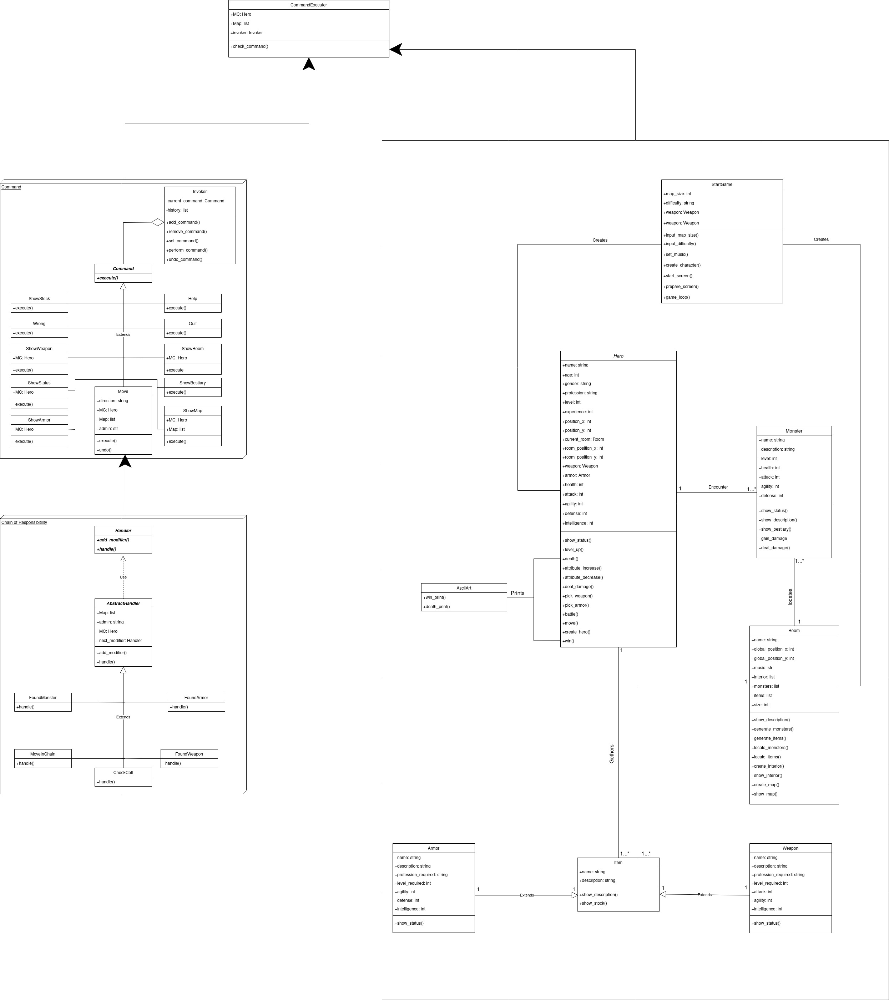

# TP_PROJECT

## Gameplay
    Player create his own character that will have to escape from the dungeon.    
    Dungeon is full of different kinds of monsters and items. There are 3 classes    
    in the game: Archer, Mage, Knight. Each of them has it own unique characteristics       
    and suitable items. Monsters attack Hero if he gets close and try to kill him.     
    After defeating monster Hero gets experiences depending on monsters strength   
    and level. Leveling up Increases Heroes characteristics which will help     
    to defeat stronger monsters. Player can choose the size of the map which must be     
    square of an odd number. Standard variant is created from 25 rooms next to each   
    other. Hero spawns in the center of the map and have to clear each room to enter   
    next one. After clearing required rooms and leaving map the Player wins the game.  

## Running the program
* ### First Download python3.8
    1. Open Terminal and use $ sudo apt-get update
    2. $ sudo apt-get install python3.8
* ### Then download colorama and pygame modules
    1. Open Terminal and use $ sudo apt-get install python3-colorama 
    2. sudo apt-get install python3-pygame
* ### After that clone the repository on your local machine
    1. Open Terminal and use $ git clone https://github.com/levante00/PROJECT.git
* ### Finally run the main.py file from Python_Project repository
    1. $ python3 main.py

## Files and repositories containing source code
*   /src - Repository that contains the files with code

*   main.py - file that contains code which runs src/Play.py

*   src/Play.py - file that contains code which is responsible for  
    the game interface, handling users input and whole game loop

*   src/Enemy.py - file that contains implementation of the Monster class

*   src/Items.py - file that contains implementation of the Item,   
    Weapon and Armor classes

*   src/character.py - file that contains implementation of the Hero class

*   src/Room.py - file that contains implementation of the Room class

## Repositories containing another data
*   /Data - Repository that contains .txt files with all rooms names,  
    music names which are used when the player is inside room and   
    music names which are used during the fights 

*   /UML_Diagrams - Repository that contains program all UML      
    diagrams in pdf and jpg formats

*   /Music - Repository that contains the whole .mp3 music files

*   /Music/Battle - Repository that contains .mp3 music files used  
    during the fights
 
*   /Music/Ending - Repository that contains .mp3 music files used  
    when the player wins or loses the game

*   /Music/Rooms - Repository that contains .mp3 music files used  
    when is inside the room

*   /Music/Start - Repository that contains .mp3 music files used  
    at the start of the game

## UML Diagram
